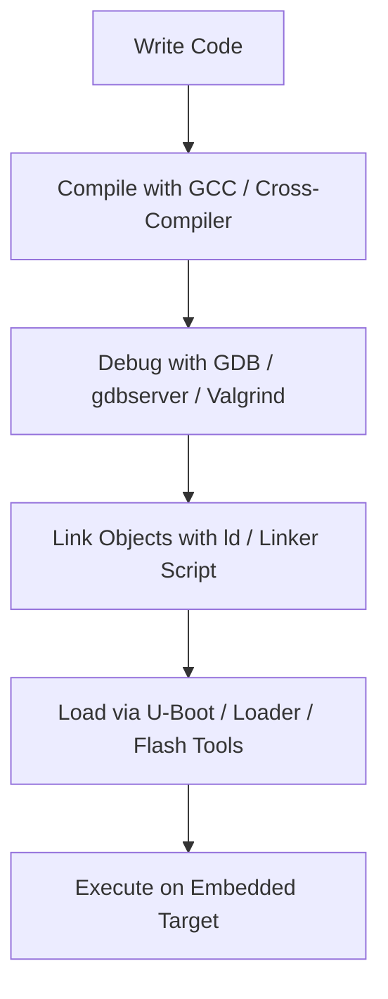

# What is an Embedded System?

An **Embedded System** is a specialized computer system designed to perform a dedicated function or set of functions within a larger mechanical or electrical system. Unlike general-purpose computers, embedded systems are optimized for specific tasks, offering better performance, reliability, and efficiency for their intended use.

---

## Embedded Systems Development Workflow

To work effectively with embedded systems, it's essential to understand and use key development tools. The typical workflow involves the following **four steps**:

1. **Writing the Program** – Using text editors (e.g., VI or VIM)
2. **Compiling the Code** – Using a compiler (e.g., GCC)
3. **Debugging the Program** – Using a debugger (e.g., GDB)
4. **Loading the Program** – Using a linker/loader (e.g., LDD)

---

## 1. Text Editors

A **text editor** is a software application used to create and modify plain text files. These are essential tools for writing code, configuration files, and scripts in embedded system development.

### Types of Text Editors

There are two main types of text editors:

- **GUI (Graphical User Interface) Editors**
- **CLI (Command Line Interface) Editors**

#### i. Graphical User Interface (GUI) Editors

GUI editors provide a visual and interactive environment. Users can use menus, buttons, and graphical tools to edit files. These editors are beginner-friendly and offer productivity features like syntax highlighting, file explorers, and extensions.

**Examples:**  
- Notepad (Windows)  
- TextEdit (macOS)  
- Visual Studio Code  
- Sublime Text  
- Atom

#### ii. Command Line Interface (CLI) Editors

CLI editors are accessed via a terminal. These are fast, lightweight, and ideal for low-resource environments or headless systems like embedded Linux.

**Examples:**  
- `vi` / `vim`  
- `nano`  
- `emacs` (also supports GUI)

CLI editors are widely used by advanced users and system administrators due to their efficiency and speed.

---

### Comparison: CLI vs GUI Editors

| Feature           | Command Line Interface (CLI)              | Graphical User Interface (GUI)              |
|------------------|-------------------------------------------|---------------------------------------------|
| **Interaction**   | Keyboard command-based                    | Visual, icon and mouse-based                |
| **Ease of Use**   | Requires memorizing commands              | Easier to understand with visual elements  |
| **Memory Usage**  | Low memory footprint                      | Higher memory due to graphics               |
| **Speed**         | Fast, efficient with keyboard shortcuts   | Slower due to mouse-based interaction       |
| **Resources Used**| Only keyboard                            | Mouse and keyboard                          |
| **Accuracy**      | High                                      | Moderate                                    |
| **Flexibility**   | Consistent over time                      | May change with UI updates                  |

---

## 2. Compiler

A **compiler** is a tool that translates source code written in a high-level language (e.g., C) into low-level machine code or assembly that the microcontroller or processor can execute.

- In embedded systems, the most commonly used compiler is the **GNU C Compiler (GCC)**.
- It performs syntax checks and generates object code from your source files.

**Role in Embedded Systems:**  
Translates your `.c` files into `.o` or `.hex` files suitable for embedded hardware.

---

## 3. Debugger

A **debugger** is a critical tool used to test and troubleshoot your embedded code during runtime.

### Types of Errors:

- **Compile-Time Errors**: Detected by the compiler (e.g., syntax errors).
- **Run-Time Errors**: Occur during execution (e.g., segmentation faults, logic errors). These are resolved using a debugger.

**Common Tool:**  
- **GDB (GNU Debugger)** – allows line-by-line execution, variable inspection, breakpoints, and watchpoints.

**Why It’s Important:**  
Even experienced developers introduce bugs. A debugger helps isolate and fix issues in complex embedded environments.

---

## 4. Linker / Loader

### Linker

- The **linker** combines multiple object files into a single executable file.
- It resolves symbol references and assigns final memory addresses.

### Loader

- The **loader** loads the executable binary into the embedded system's memory (e.g., Flash or RAM).
- Some platforms use tools like **LDD** or device-specific bootloaders to load and start execution.

---

## Summary

| Step         | Tool Used         | Purpose                                         |
|--------------|------------------|-------------------------------------------------|
| Write Code   | Text Editor       | Create C source files (`.c`)                    |
| Compile Code | GCC Compiler      | Convert source to machine code (`.hex`, `.o`)   |
| Debug Code   | GDB Debugger      | Diagnose and fix runtime issues                 |
| Load Code    | Linker/Loader     | Load the final binary into target hardware      |

---

By mastering these tools and workflows, you lay the foundation for effective and efficient embedded systems development.
#Linux and its devlopment tools
# Embedded Systems Development Workflow (with Linux Context)

## What is an Embedded System?

An **Embedded System** is a specialized computer designed to perform a dedicated task within a larger system. It is optimized for performance, reliability, and efficiency for a specific application.

---

## Development Workflow (Linux-Based)

The typical development flow for embedded systems under Linux includes the following steps:

### 1. Writing the Program – Using Text Editors

Text editors are used to write the source code.

- **CLI Editors:** `vim`, `nano`, `emacs`
- **GUI Editors:** `gedit`, `VS Code`, `KDevelop`, `Sublime Text`

###  2. Compiling the Code – Using a Compiler

The compiler translates your C/C++ code into machine-readable format.

- **Cross-Compilers:**
  - `arm-none-eabi-gcc` (bare-metal ARM)
  - `arm-linux-gnueabihf-gcc` (Linux on ARM)
- **Build Systems:**
  - `Make`, `CMake`
  - **Yocto**, **Buildroot**, **OpenWRT**

### 3. Debugging – Using Debugger

Debugging tools help you test and troubleshoot runtime errors.

- **User-space Debugging:**
  - `gdb`, `strace`, `valgrind`
- **Kernel-space Debugging:**
  - `kgdb`, `ftrace`, `perf`, `dmesg`, `SystemTap`
- **Remote Debugging:**
  - `gdbserver` (on target), `gdb` (on host)

### 4. Linking & Loading – Using Linkers and Loaders

- **Linking:**
  - GNU `ld`, linker scripts (`.ld`) for memory layout
- **Loading:**
  - **Bare-metal:** OpenOCD, JTAG, STLink, `.hex` loaders
  - **Linux:** U-Boot bootloader, `scp`, `rsync`, NFS, `systemd` services

---

##  Overview

| **Step**         | **Tool Used**                              | **Linux Context**                                                         |
|------------------|--------------------------------------------|---------------------------------------------------------------------------|
| Write Code       | Text Editor (CLI or GUI)                   | `vim`, `nano`, `gedit`, `VS Code`, etc.                                  |
| Compile Code     | GCC, Cross-compilers, Build Systems        | `arm-linux-gnueabihf-gcc`, `Make`, `Yocto`, `Buildroot`, `CMake`         |
| Debug Code       | GDB, strace, Valgrind, perf                | Use `gdbserver` for remote; trace system calls or memory usage           |
| Load & Run Code  | Loader, U-Boot, systemd, flash tools       | Use `scp`, `NFS`, `U-Boot`, `systemd` to deploy and manage applications  |

---

## Additional Linux Tools

| **Tool**         | **Purpose**                                      |
|------------------|--------------------------------------------------|
| `menuconfig`     | Configure kernel or Buildroot/Yocto options      |
| `dd`, `mkfs`     | Create filesystems for SD cards or flash storage |
| `Device Tree`    | Hardware description for the Linux kernel        |
| `QEMU`           | Emulate target systems                           |

---

## Visual Workflow Diagram (Markdown)


# VI - Text Editor

1. **VI** stands for **Visual Interface**. The advanced version of the Vi text editor is **Vim - Vi Improved**.
2. In Linux, we generally use CLI-based tools, such as the **Vi text editor**.
3. When you open the Ubuntu OS, there is a special application called the **Terminal Application**.
4. To write any C program, use the command:  
   ```bash
   $ vi filename.c
   ```
5. To open an existing C program:  
   ```bash
   $ vi filename.c
   ```
6. To list files present in the directory:  
   ```bash
   $ ls
   ```
7. **What are the different types of files that can be seen on the terminal when you run `$ls`?**  
   There are three types of files:
   - **White-colored files**: Normal/Text files.
   - **Blue-colored files**: Directories/Folders.
   - **Green-colored files**: Executable files.

8. **How can you view file information?**  
   By using additional flags with the `ls` command, such as:  
   ```bash
   $ ls -l
   ```
   This displays:
   - File permissions (Read/Write/Execute)
   - User name / Group
   - Size of the file
   - Date and time of last modification
   - File name

9. **Where can you find the flags and options used with the `$ls` command?**  
   - Use the manual pages:  
     ```bash
     $ man ls
     ```
   - Use the help option:  
     ```bash
     $ ls --help
     ```

10. **How to compile a C program in Ubuntu?**  
    Use the command:  
    ```bash
    $ gcc filename.c
    ```
    - This compiles the C statements into instructions.
    - Instructions contain **opcodes (operation codes)** and **operands**:
      - **Opcode**: Unique code specifying the operation.
      - **Operand**: Address in memory (can be a value or CPU register name).

11. **How to create a new directory?**  
    Use the command:  
    ```bash
    $ mkdir directory_name
    ```
    For help:
    ```bash
    $ man mkdir
    $ mkdir --help
    ```

12. **How to remove a directory?**  
    - To remove an **empty directory**:
      ```bash
      $ rmdir directory_name
      ```
      or
      ```bash
      $ rm -d directory_name
      ```
    - To remove a **non-empty directory**:
      ```bash
      $ rm -r directory_name
      ```
      `-r` stands for **recursive**, meaning it removes all subfolders and files.

    For help:
    ```bash
    $ man rmdir
    $ rmdir --help
    $ man rm
    ```
    ### 19. How can you copy a single line or multiple lines in `vi`/`vim`?

- **A.** For copying a single line we use → `yy` (yy stands for *Yankee*, meaning *copy*).
- **B.** For copying 2 lines we use → `2yy`.
- **C.** For copying 4 lines we use → `4yy`.
- **D.** Similarly, for copying *n* lines we use → `nyy`.

---

### 20. How can you paste a single line or multiple lines in `vi`/`vim`?

- **A.** For pasting a single line → use `p`.
- **B.** For pasting 2 lines → use `p` (press `p` again to paste multiple times).
- **C.** For pasting 4 lines → use `p` (repeat `p` or use a count before it, like `4p`).
- **D.** Similarly, for pasting *n* lines → use `p`.

> There are **two types** of pasting:
> - `P` → Paste **above** the current cursor line.
> - `p` → Paste **below** the current cursor line.

---

### 21. What is Linux? How many layers are present?

**Linux** is a free and open-source **Operating System kernel** — the core component of a computer's software.

It consists of **two main layers**:

1. **User Space** – contains applications and user interfaces.
2. **Kernel Space** – contains core system functionalities like **device drivers**, memory management, and process scheduling.

